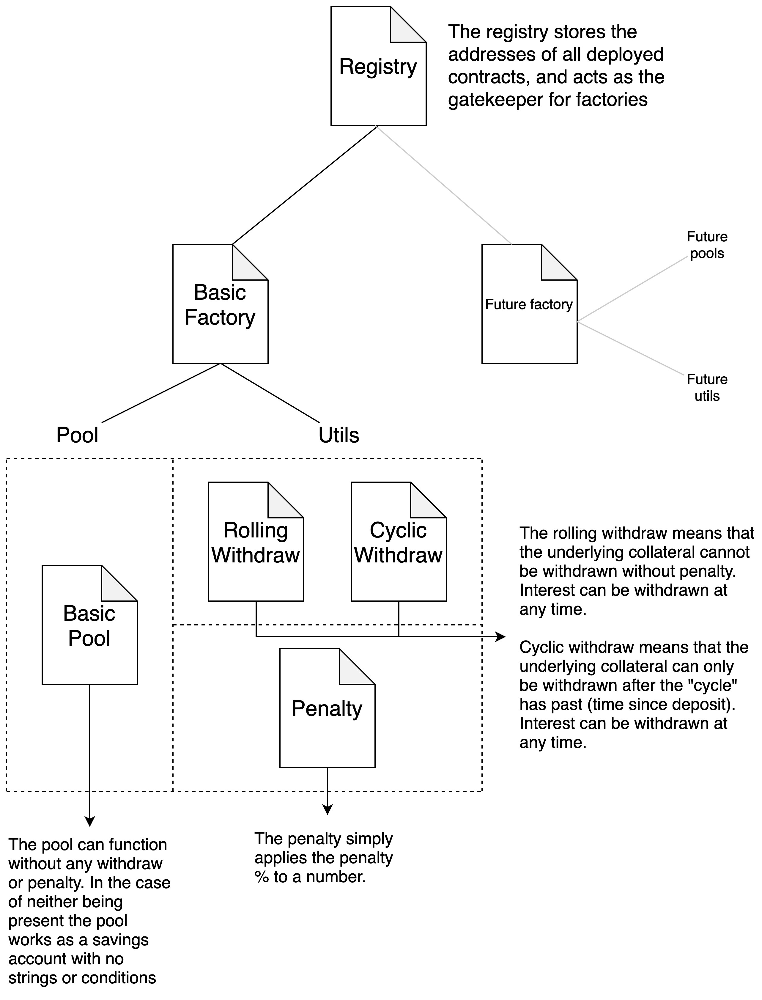

<div align="center">
    
    <h1>Nobuntu Time Deposit</h1>
    <h3>A collective savings mechanism</h3>
</div>

---

# Index
* [Time Deposit Purpose](#time-deposit-purpose)
* [Smart contract overview](#smart-contracts-overview)
* [How the smart contracts fit together](#how-the-smart-contracts-fit-together)
* [Individual Contract Breakdown](#individual-contract-breakdown)
    * [Registry](#registry)
    * [Factory](#factory)
    * [Pool](#pool)
    * [Utilities](#utilities)
        * [Cyclic Withdraw](#cyclic-withdraw)
        * [Rolling Withdraw](#rolling-withdraw)
        * [Penalty](#penalty)

---

# Time Deposit Purpose
The time deposit smart contract ecosystem is designed as a collective savings mechanism. The `pool` allows users to deposit Dai (but is designed so that Dai could be swapped out for any ERC20 compliant token). The pool than buys cDai (cDai can be swapped out for any interest bearing token, so long as that token is wrapped in the `ICToken` interface). 

The pool will hold the cDai until the user wishes to withdraw their funds. If the pool is using a `cyclicWithdraw` utility, than the user will be penalized if they try remove funding before the end of the cycle. The penalty is available to any user with tokens inside the pool, distributed by the users portion of cDai to the pools total balance of cDai. This allows for a flat distribution amount depositors.

This contract ecosystem will also serve as the base for future iterations of the time deposit ecosystem. 

# Smart Contracts Overview
The smart contracts for this project where designed in such a way as to allow for  flexible extension of  the contract ecosystem. The hub and spoke pattern was used, as can be seen in the `factory` and `registry`. The `registry` contract stores all deployed pools and their associated information. Factories are registered with the `register` and thereafter are able to register pools. Should a new type of pool be created, a new `factory` can be created to deploy the new pool. The new `factory` can then be registered with the `registry` as a deployer, and be able to deploy and interact with the smart contract ecosystem. 

# How the Smart Contracts Fit Together
Below is a diagram outlining the design and structure of the smart contract architecture. 

<div align="center">

</div>

As can be seen by the `Future factory`, `future pools` and `future utils`, this ecosystem has been designed to accommodate newer versions and iterations of the pool and utils. Factories can also be switched on and off as registered deployers. 

# Individual Contract Breakdown
Below is a further break down of important functionality within each of the contracts. 

**Note:** All contracts (except the utilities) inherit `WhitelistAdmin` and are owned and controlled by their admin. The deployer (the address that was used to deploy the contracts) is removed as an admin. This is to ensure the insecure deployer address is never the admin of any contract. The reason the utilities do not inherit from `WhitelistAdmin` is because nothing can change within them after deployment, so they do not need to be admin managed. 

## Registry
The `registry` contract is a storage mechanism for factories, deployed pools and utilities. Factories get resisted as deployers:

```
    /**
      * @notice  Allows a whitelist admin to register a deployer.
      * @param   _deployer The address of the deployer
      * @param   _deployerStatus If the deployer should be active or inactive.
      */
    function registerDeployer(
        address _deployer,
        bool _deployerStatus
    )
        public
        onlyWhitelistAdmin()
    {
```
The `_deployerStatus` is used to toggle a deployers status on and off. 

The factory is then able to register pools. The pool can be registered with or without a withdraw utility. Below is the function to register a pool:
```
    /**
      * @notice This allows a registered deployer to register a deployed pool.
      * @param  _admin The address of the admin
      * @param  _pool The address of the pool
      * @param  _withdraw The address of the withdraw library. Note: This can be
      *         a 0 address if the pool was deployed without a withdraw library
      * @param  _poolName The name of the pool
      * @param  _poolDescription The description of the pool
      * @return bool If the pool was successfully registered
      */
    function registerPool(
        address _admin,
        address _pool,
        address _withdraw,
        string memory _poolName,
        string memory _poolDescription
    )
        public
        onlyDeployer()
        returns(bool)
    {
```

The registry also stores the utilities that have been deployed (so that they can be reused in different pools). Below is the function to register a utility:

```
    /**
      * @notice Allows a registered deployer to register a deployed utility
      * @param  _admin The address of the admin (user who deployed)
      * @param  _contract The address of the utility (penalty/cyclic/rolling)
      * @param  _name The name for the utility
      * @param  _type The type of utility being registered (please see the 
      *         ContractType enum for utility types)
      * @return bool If the utility was successfully registered.
      */
    function registerUtility(
        address _admin,
        address _contract,
        string memory _name,
        uint8 _type
    )
        public
        onlyDeployer()
        returns(bool)
    {
```
Each utility must be registered separately. 

## Factory
The factory allows admins to deploy new pools and utilities, as well as choosing the tokens that will be used for all the pools created from that factory. The tokens are chosen by sending through the address in the constructor for both the underlying collateral token as well as the interest earning token. 

The admin can deploy a pool by calling the below function: 
```
    /**
      * @notice Allows an admin to deploy a basic pool
      * @param  _withdraw The address of the withdraw library to be used. Note:
      *         this can be a 0 address should the pool not need the withdraw
      *         library.
      * @param  _poolName The name of the pool
      * @param  _poolDescription A description of the pool
      * @return The address of the deployed pool
      */
    function deployBasicPool(
        address _withdraw,
        string memory _poolName,
        string memory _poolDescription
    )
        public
        onlyWhitelistAdmin()
        returns(address)
    {
```

The admin can also deploy new utilities, as shown below. Using the below function will deploy both the penalty utility as well as the withdraw. 

```
    /**
      * @notice Allows an admin to deploy a utility pair. This pair consists of
      *         a withdraw library and a penalty library
      * @param  _penaltyPercentage The percentage (as a whole number) the 
      *         penalty will be. Note: The penalty must be within th 1 - 99 
      *         range
      * @param  _cycleLength The length (in months) of the cyclic withdraw.
      *         Note: If this is 0 a rolling withdraw library will be deployed
      *         instead of the cyclic
      * @param  _canWithdrawInViolation This switch (if true) allows a user to 
      *         withdraw their funds in violation (of the cycle or rolling), and
      *         have the penalty applied. 
      *         If false, a user will be blocked from withdrawing in violation.
      *         Note: If this is set to false in a rolling withdraw the user
      *         will never be able to withdraw their underlying investment.
      * @param  _canWithdrawInterestInViolation Much like the above switch, this
      *         switch will do the same blocking action in violation but for any
      *         interest earned.
      * @param  _penaltyName The name the penalty library should be called
      * @param  _withdrawName The name the withdraw library should be called
      * @return address The address of the withdraw library
      * @return address The address of the penalty library
      */
    function deployUtility(
        uint8 _penaltyPercentage,
        uint8 _cycleLength,
        bool _canWithdrawInViolation,
        bool _canWithdrawInterestInViolation,
        string memory _penaltyName,
        string memory _withdrawName
    )
        public
        onlyWhitelistAdmin()
        returns(address, address)
    {
```

## Pool
The pool allows any address to deposit the underlying collateral into it, and withdraw that collateral, the interest, and any penalty pot the are entitled to. 
The pool also has some admin only functionality, such as terminating the pool, setting a fee etc. 

First we will cover the admin functionality, and then move onto the general functionality. 

Below is the function that allows an admin to set a fee. This fee is taken as a percentage of any penalty:
```
    /**
      * @notice This function allows admins to set the fee for the pool. This 
      *         fee can only be set once, and cannot be edited. This fee is 
      *         taken off as a percentage of any penalties
      * @dev    If no fee is set the contracts will still work
      * @param  _fee The fee that will be applied to any penalties
      */
    function init(uint8 _fee) public onlyWhitelistAdmin() {
```

Below is the function that allows admins to withdraw the collected fee:
```
    /**
      * @notice Allows an admin to withdraw the accumulated admin fee.
      */
    function withdrawAdminFee() public onlyWhitelistAdmin() {
```

The admin user also has the ability to terminate the pool. Please do note that users will be blocked from depositing and withdrawing, and will only be able to use the pre-allocated `finalWithdraw()` function to remove their funding after the pool has been terminated. 
```
    /**
      * @notice Allows an admin to terminate the pool. Terminating the pool will
      *         prevent any new deoposits, as well as blocking all withdraws. 
      *         There is a specific withdraw (finalWithdraw) that will only be 
      *         accessible after the pool has been terminated
      */
    function terminatePool() public onlyWhitelistAdmin() {
```

Onto the non admin functionality.

A general user has the ability to deposit funds into the pool:
```
    /**
      * @notice Allows a user to deposit underlying collateral into the 
      *         contract, where it will then be converted into the interest 
      *         earning asset
      * @param  _amount the amount of the raw token they  are depositng
      */
    function deposit(uint256 _amount) public killSwitch() {
```

Withdraw interest from the pool:
```
    /**
      * @notice Allows a user to withdraw their interest and penalty pot share
      */
    function withdrawInterest() public killSwitch() {
```

And withdraw their general collateral from the pool. Note that if a penalty applies, this is where it will be taken off of the user balance:
```
    /**
      * @notice This call will add any unclaimed interest to the users balance. 
      *         This added interest does not include any penalty
      * @param  _amount The amount the user would like to withdraw 
      */
    function withdraw(uint256 _amount) public killSwitch() {
```

Finally, the user can withdraw all their funding from their account:
```
    /**
      * @notice Allows a user to withdraw all the funds from their account
      */
    function withdrawAndClose() public killSwitch() {
```

In the case of the pool being terminated, the users can then use this function to remove any remaining funding:
```
    /**
      * @notice Allows a user to withdraw their collateral after the pool has 
      *         been ternmiated
      */
    function finalWithdraw() public {
```

## Utilities 
There are currently 3 different types of utilities. Please see the [How the Smart Contracts Fit Together](#how-the-smart-contracts-fit-together) section to se how they fit together. 

### Cyclic Withdraw
The cyclic withdraw is not `WhitelistAdmin` owned, as nothing can change after deployment. 

Below is the function that the pool calls to check if an interest withdraw is allowed (as the interest withdraw can be blocked in violation of the time period):
```
    /**
      * @param  _lastWithdraw The time stamp of the last withdraw
      * @return bool If the user can withdraw or not
      */
    function canWithdrawInterest(
        uint256 _lastWithdraw
    ) 
        public 
        view 
        returns(bool) 
    {
```

Below is the function the pool calls to verify if a withdraw is valid:
```
    /**
      * @param  _amount The amount the user would like to withdraw
      * @param  _lastWithdraw The time stamp of the users last withdraw
      * @return bool If the user can withdraw in violation at all
      * @return uint256 The withdraw amount (if there is no penalty this amount
      *         will be the full amount the user wanted to withdraw)
      * @return uint256 The penalty amount (if no peanlty is applied this will 
      *         be 0)
      */
    function canWithdraw(
        uint256 _amount,
        uint256 _lastWithdraw
    )
        public 
        view
        returns(bool, uint256, uint256) 
    {
```

Below is the function the pool will call when a user wishes to withdraw. This function is separate to the last function as this one will revert if the withdraw in violation is not allowed.
```
    /**
      * @notice This function will revert if the user cannot withdraw in 
      *         voliation and the user is still within the violation period
      * @param  _amount The amount the user would like to withdraw
      * @param  _lastWithdraw The time stamp of the users last withdraw
      * @return uint256 The withdraw amount (if there is no penalty this amount
      *         will be the full amount the user wanted to withdraw)
      * @return uint256 The penalty amount (if no peanlty is applied this will 
      *         be 0)
      */
    function calculateWithdraw(
        uint256 _amount,
        uint256 _lastWithdraw
    )
        public
        view
        returns(uint256, uint256) 
    {
```

### Rolling Withdraw
The rolling withdraw is almost identical to the cyclic withdraw, except the withdrawal of collateral or interest cannot be blocked, and there is no time period (thus rolling).

Below is the function the pool can call to check if the interest can be withdrawn:
```
    /**
      * @param  _lastWithdraw The time stamp of the last withdraw
      * @return bool If the user can withdraw or not. This will always be true 
      *         in the rolling wihtdraw
      */
    function canWithdrawInterest(
        uint256 _lastWithdraw
    ) 
        public 
        view 
        returns(bool) 
    {
```

Below is the function that the pool calls to check if a user can withdraw:
```
    /**
      * @param  _amount The amount the user would like to withdraw
      * @param  _lastWithdraw The time stamp of the users last withdraw
      * @return bool If the user can withdraw
      * @return uint256 The withdraw amount (if there is no penalty this amount
      *         will be the full amount the user wanted to withdraw)
      * @return uint256 The penalty amount (if no peanlty is applied this will 
      *         be 0)
      */
    function canWithdraw(
        uint256 _amount,
        uint256 _lastWithdraw
    )
        public 
        view
        returns(bool, uint256, uint256) 
    {
```

Below is the function the pool will call when a user wishes to withdraw. This function is separate to the last function as this one will revert if the withdraw in violation is not allowed.
```
    /**
      * @notice This function will not revert, as the user will never be in 
      *         violation
      * @param  _amount The amount the user would like to withdraw
      * @param  _lastWithdraw The time stamp of the users last withdraw
      * @return uint256 The withdraw amount (if there is no penalty this amount
      *         will be the full amount the user wanted to withdraw)
      * @return uint256 The penalty amount (if no peanlty is applied this will 
      *         be 0)
      */
    function calculateWithdraw(
        uint256 _amount,
        uint256 _lastWithdraw
    )
        public
        view
        returns(uint256, uint256) 
    {
```

### Penalty
The penalty contract is separate in order to accommodate later iterations where the penalty will not be applied as a fixed percentage. 

The below function allows the withdraw library to apply the penalty to a withdraw:
```
    /**
      * @notice Works out the amount of penalty to take of the provided amount.
      * @param  _amount The amount to remove the penalty from
      * @return uint256 The amount the user will recive
      * @return uint256 The penalty amount 
      * @dev    This function does not check if the penality applies, it only
      *         applies it. It is the withdraw library that checks if the
      *         penality applies.
      * @dev    Here is where a variable penalty would be implemented 
      */
    function penalize(uint256 _amount) public view returns(uint256, uint256) {
```

The below function allows both the pool and the withdraw library to check the penalty amount:
```
    /**
      * @return uint8 The penalty percentage as a whole number
      */
    function penalty() public view returns(uint8) {
```

# Testing

Please note that inside the tests there are some blank console logs (`console.lo("")`). These are to counter a sequencing issue that occurs within ganache (the local testing blockchain).

If they are removed the tests may act in unexpected ways as the transaction ordering will be disrupted. 